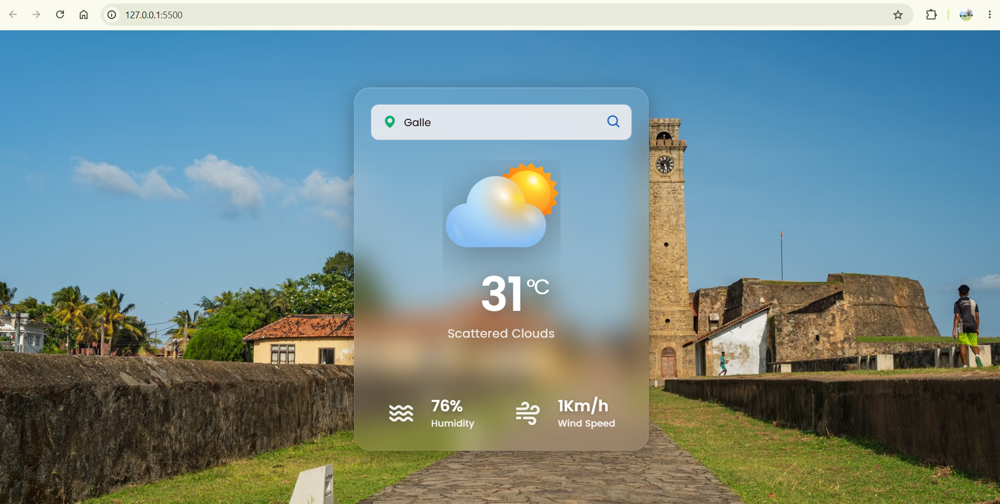
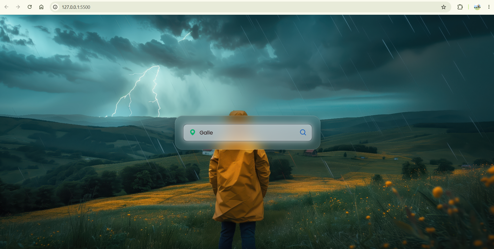

<div align="center">

# 🌤️ Weather App

### *"Know the weather, plan your day!"*


[](https://binusha12345.github.io/weather-app)
[](https://github.com/binusha12345/weather-app)
[](LICENSE)

---

</div>

## 📋 Table of Contents

- [🌟 Overview](#-overview)
- [✨ Features](#-features)
- [🖼️ Screenshots](#️-screenshots)
- [🛠️ Technologies Used](#️-technologies-used)
- [🚀 Getting Started](#-getting-started)
- [🔑 API Keys Configuration](#-api-keys-configuration)
- [📖 Usage](#-usage)
- [📁 Project Structure](#-project-structure)
- [🤝 Contributing](#-contributing)
- [📄 License](#-license)

---

## 🌟 Overview

This **Weather App** is a modern, responsive web application that provides real-time weather information for any city worldwide. Built with vanilla JavaScript, it fetches live data from the **OpenWeatherMap API** and enhances the experience with stunning city background images from **Pexels API**.

> 💡 *Simply type a city name and instantly get current temperature, weather conditions, humidity, and wind speed — all wrapped in a beautiful, animated UI.*

---

## ✨ Features

| Feature | Description |
|---------|-------------|
| 🌍 **Global Search** | Search weather for any city in the world |
| 🌡️ **Real-time Temperature** | Live temperature in Celsius with weather condition icons |
| 💧 **Humidity Data** | Current humidity percentage display |
| 🌬️ **Wind Speed** | Real-time wind speed in Km/h |
| 🖼️ **Dynamic Backgrounds** | Auto-fetches stunning city landscape images from Pexels |
| 🎨 **Weather Icons** | Visual icons for Clear, Rain, Snow, Clouds, Mist, and Haze conditions |
| ❌ **Error Handling** | Friendly "Location Not Found" message for invalid cities |
| 📱 **Responsive Design** | Works seamlessly on desktop and mobile devices |
| 🎞️ **Smooth Animations** | Elegant transitions and animations for a polished UX |

---

## 🖼️ Screenshots

<div align="center">

**Weather Display** | **Error State** 
:-----------------:|:--------------:
 | 

*🌅 Background images change dynamically based on the searched city*

</div>

---

## 🛠️ Technologies Used

<div align="center">

| Technology | Purpose |
|:----------:|:--------|
|  **HTML5** | Structure & Layout |
|  **CSS3** | Styling & Animations |
|  **JavaScript** | Application Logic & API Integration |
|  **OpenWeatherMap API** | Weather Data |
|  **Pexels API** | Background Images |

</div>

---

## 🚀 Getting Started

### Prerequisites

- A modern web browser (Chrome, Firefox, Edge, Safari)
- Internet connection for API calls
- API keys (see [API Keys Configuration](#-api-keys-configuration))

### Installation

1. **Clone the repository**
   ```bash
   git clone https://github.com/binusha12345/weather-app.git
   ```

2. **Navigate to the project directory**
   ```bash
   cd weather-app
   ```

3. **Open the application**
   - Simply open `index.html` in your browser, **or**
   - Use Live Server in VS Code for auto-reload

---

## 🔑 API Keys Configuration

> ⚠️ **Note:** This project includes demo API keys. For production use, replace them with your own.

### 1️⃣ OpenWeatherMap API Key
1. Visit [OpenWeatherMap](https://openweathermap.org/api) and sign up
2. Generate a free API key
3. Open `scripts.js` and replace:
   ```javascript
   const APIKey = 'YOUR_OPENWEATHERMAP_API_KEY';
   ```

### 2️⃣ Pexels API Key (Optional - for dynamic backgrounds)
1. Visit [Pexels API](https://www.pexels.com/api/) and sign up
2. Get your free API key
3. Open `scripts.js` and replace:
   ```javascript
   const pexelsAPIKey = 'YOUR_PEXELS_API_KEY';
   ```

---

## 📖 Usage

1. **Type a city name** in the search bar (e.g., "London", "Tokyo", "New York")
2. **Click the search button** or press Enter
3. **View weather data**:
   - 🌡️ Current temperature in Celsius
   - ☁️ Weather condition with description
   - 💧 Humidity percentage
   - 🌬️ Wind speed
4. **Enjoy the view** — the background changes to a beautiful image of your searched city!

> 🌟 *Try searching for different cities to explore various weather conditions and backgrounds!*

---

## 📁 Project Structure

```
🌤️ weather-app/
│
├── 📄 index.html          # Main HTML structure
├── 📄 style.css           # Styling & animations
├── 📄 scripts.js          # Application logic & API calls
├── 📄 README.md           # You are here! 🎯
│
└── 🖼️ images/
    ├── 404.png            # Error state image
    ├── background.jpg     # Default background
    ├── clear.png          # ☀️ Clear weather icon
    ├── cloud.png          # ☁️ Cloudy weather icon
    ├── mist.png           # 🌫️ Misty weather icon
    ├── rain.png           # 🌧️ Rainy weather icon
    ├── snow.png           # ❄️ Snowy weather icon
    └── thunderstorm-village.jpg  # ⛈️ Storm image
```

---

## 🤝 Contributing

Contributions are welcome! Here's how you can help:

<div align="center">

[](http://makeapullrequest.com)

</div>

1. 🍴 **Fork** the Project
2. 🌿 **Create a Feature Branch** (`git checkout -b feature/AmazingFeature`)
3. 💾 **Commit Changes** (`git commit -m 'Add some AmazingFeature'`)
4. 📤 **Push to Branch** (`git push origin feature/AmazingFeature`)
5. 🔃 **Open a Pull Request**

---

## 📄 License

<div align="center">

Distributed under the **MIT License**. See `LICENSE` for more information.

[](LICENSE)

---

### ⭐ Show some support!

If you like this project, please give it a **⭐ star** on GitHub!

[](https://github.com/binusha12345/weather-app)

---

**Made with ❤️ and ☕ by [Binusha](https://github.com/binusha12345)**

</div>